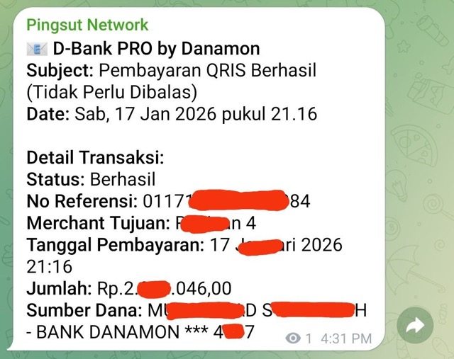

# Email Parser Worker

A Cloudflare Worker that parses incoming emails **Transaction Notification from Danamon** using `postal-mime` and forwards transaction details to Telegram and WhatsApp (via WAHA).

## Features
- Parses extracting:
  - **Sender** (Original sender if forwarded)
  - **Subject**
  - **Status**
  - **No. Referensi**
  - **Merchant Tujuan**
  - **Tanggal Pembayaran**
  - **Jumlah**
  - **Sumber Dana** (Supports "Rekening Sumber")
- Sends formatted notifications to Telegram.
- Forwards the same notification to a WhatsApp group via WAHA (optional, enable with `WA_ENABLED=true`).
- Supports handling forwarded emails (extracts original details).

```json
--- Extracted Data ---
{
  "status": "Berhasil",
  "noRef": "01171597422XXXX4",
  "merchantTujuan": "RiXXXXXn 4",
  "tanggalPembayaran": "17 JaXXXXXri 2026 XX:16",
  "jumlah": "Rp.2.XXX.046,00",
  "sumberDana": "MUXXXXXD SXXXXXXXXH - BANK DANAMON *** 4XX7"
}
```



## Setup

1.  **Install Dependencies**:
    ```bash
    npm install
    ```

2.  **Local Testing**:
    You can test with a local `.eml` file:
    ```bash
    npm run test:local
    ```
    Ensure you have Pembayaran QRIS Berhasil (Tidak Perlu Dibalas).eml` or `Fwd_Pembayaran QRIS Berhasil (Tidak Perlu Dibalas).eml` in the root.

3.  **Secrets Configuration**:
    For local development, create a `.dev.vars` file:
    ```ini
    TELEGRAM_BOT_TOKEN="your_token"
    TELEGRAM_CHAT_ID="your_chat_id"
    # Optional: kirim ke topik tertentu di grup (forum topic)
    TELEGRAM_TOPIC_ID="your_topic_id"
    WA_API_URL="https://your-waha-server"
    WA_API_KEY="your_waha_api_key"
    WA_GROUP_ID="your_whatsapp_group_id"
    WA_SESSION="default"  # optional, defaults to "default"
    WA_ENABLED="true"  # optional, defaults to off
    ```

## Deployment

1.  **Authenticate**:
    ```bash
    npx wrangler login
    ```

2.  **Set Secrets** (Production):
    Run the following commands and enter values when prompted:
    ```bash
    npx wrangler secret put TELEGRAM_BOT_TOKEN
    npx wrangler secret put TELEGRAM_CHAT_ID
    # Optional: hanya jika kirim ke topik tertentu
    npx wrangler secret put TELEGRAM_TOPIC_ID
    npx wrangler secret put WA_API_URL
    npx wrangler secret put WA_API_KEY
    npx wrangler secret put WA_GROUP_ID
    npx wrangler secret put WA_SESSION  # optional
    # WA_ENABLED is set in wrangler.toml under [vars] ("true" to enable, "false" to disable)
    ```
    *Note: You can also set these in the Cloudflare Dashboard under Worker > Settings > Variables and Secrets.*

3.  **Deploy**:
    ```bash
    npm run deploy
    ```

## Project Structure
- `src/index.ts`: Main worker logic.
- `scripts/test-local.ts`: Local testing script.
